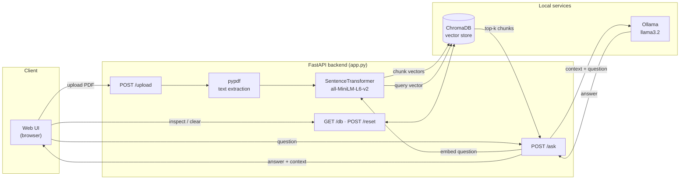
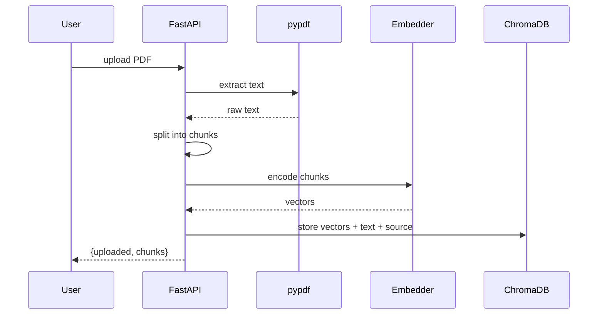
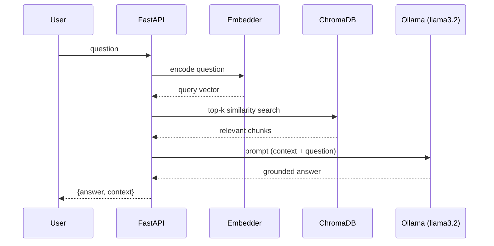
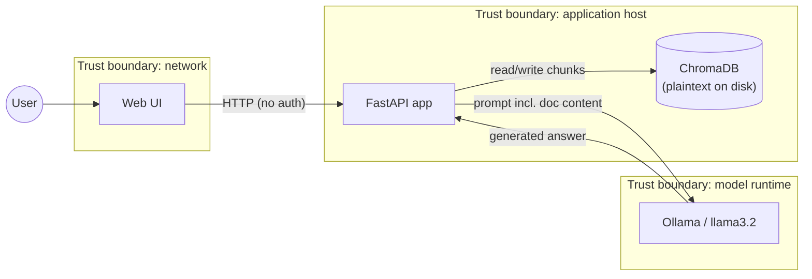

# Mini RAG

A minimal **Retrieval-Augmented Generation (RAG)** demo: upload a PDF, its content is
indexed into a vector database, and you can ask natural-language questions that are
answered **only** from the uploaded documents. The language model runs locally through
[Ollama](https://ollama.com), so no data leaves your machine and no paid API key is
required.

## Architecture



## How it works

The RAG flow has three phases:

1. **Ingestion** — the PDF text is extracted, split into chunks, and turned into vectors
   (embeddings) using the `all-MiniLM-L6-v2` model. The vectors are stored in ChromaDB.
2. **Retrieval** — the user question is converted into a vector and the `k` most
   semantically similar chunks are searched in the database (default `k=5`).
3. **Generation** — the retrieved chunks are passed as context to an LLM (`llama3.2` via
   Ollama), which generates an answer grounded in that context.

**Ingestion flow** (`POST /upload`):



**Query flow** (`POST /ask`):



## Requirements

- Python 3.11+
- [Ollama](https://ollama.com) installed and running, with the model pulled:
  ```bash
  ollama pull llama3.2
  ```

## Running locally

```bash
# 1. Virtual environment and dependencies
python3 -m venv .venv
source .venv/bin/activate
pip install -r requirements.txt

# 2. Start the server (Ollama must already be running)
uvicorn app:app --reload
```

The app is available at `http://localhost:8000`.

## Running with Docker

```bash
docker build -t mini-rag .
docker run -p 8000:8000 \
  -e OLLAMA_URL=http://host.docker.internal:11434/v1 \
  mini-rag
```

`host.docker.internal` lets the container reach Ollama running on the host machine.

## Web interface

Opening `http://localhost:8000` gives you a minimal UI to:

- **Upload PDF** — index a document into the vector store
- **Show DB** — view the stored chunks and their source
- **Clear DB** — empty the database
- **Send** — ask a question about the uploaded documents

## API

| Method | Endpoint  | Description |
|--------|-----------|-------------|
| `GET`  | `/`       | Web interface |
| `POST` | `/upload` | Upload and index a PDF (`multipart/form-data`, field `file`) |
| `POST` | `/ask`    | Ask about the documents — body `{"question": "..."}` |
| `GET`  | `/db`     | Vector store contents (chunks + metadata) |
| `POST` | `/reset`  | Empty the vector store |

Example:

```bash
curl -X POST http://localhost:8000/ask \
  -H "Content-Type: application/json" \
  -d '{"question": "What technical skills are listed?"}'
```

## Configuration

| Variable     | Default                          | Description |
|--------------|----------------------------------|-------------|
| `OLLAMA_URL` | `http://localhost:11434/v1`      | Ollama OpenAI-compatible endpoint |

The vector store persists in `./chroma_db/`: delete the folder (or use `/reset`) to start
from an empty database.

## Threat model

> This is a demo running on `localhost` with no authentication. The model below
> documents the relevant risks and the mitigations required **before any exposed or
> multi-user deployment**. It follows the [STRIDE](https://en.wikipedia.org/wiki/STRIDE_model) methodology.

### Data flow & trust boundaries



### Assets

- **Uploaded documents** — may contain PII or confidential data (e.g. a CV).
- **Vector store** (`chroma_db/`) — extracted text stored **in plaintext** on disk.
- **Model runtime** — the Ollama endpoint and its compute resources.

### STRIDE analysis

| # | Threat | STRIDE | Description | Mitigation |
|---|--------|--------|-------------|------------|
| 1 | Unauthenticated access | **S** / **E** | Every endpoint is open; anyone reaching port 8000 can upload, query, dump or wipe data. | Add authentication (API key / OAuth) and per-user authorization. |
| 2 | Data dump via `/db` | **I** | `/db` returns **all** stored chunks to any caller — full content disclosure, no tenant isolation. | Require auth; scope results to the caller; remove/limit in production. |
| 3 | Destructive `/reset` | **T** / **D** | Any caller can erase the entire vector store. | Auth + authorization; soft-delete; confirmation token. |
| 4 | Indirect prompt injection | **T** | A malicious PDF can embed instructions ("ignore previous instructions…") that hijack the LLM output, since document text is concatenated into the prompt. | Delimit/escape context; system prompt hardening; output validation; treat retrieved text as untrusted. |
| 5 | Unrestricted file upload | **D** | No size/MIME limit; large or malformed PDFs (decompression bombs) can exhaust memory/CPU. | Enforce max size, validate MIME, sandbox/limit parsing, timeouts. |
| 6 | No rate limiting | **D** | Each request triggers embedding + LLM inference; trivial to exhaust resources. | Rate limiting / quotas per client. |
| 7 | Plaintext data at rest | **I** | Extracted text (incl. PII) is stored unencrypted in `chroma_db/`. | Disk/volume encryption; restrict file permissions; retention policy. |
| 8 | SSRF via `OLLAMA_URL` | **T** / **I** | If an attacker controls the `OLLAMA_URL` env var, traffic (incl. document content) can be redirected. | Treat env config as trusted; validate/allowlist the endpoint. |
| 9 | No audit trail | **R** | Uploads and queries are not logged; actions cannot be attributed. | Structured audit logging (who/what/when), tamper-evident storage. |

### Out of scope (demo assumptions)

- Single trusted user on `localhost`.
- Ollama and the app run on the same trusted host.
- No network exposure beyond the local machine.

## Tech stack

- **FastAPI** — web framework and API
- **ChromaDB** — persistent vector database
- **sentence-transformers** (`all-MiniLM-L6-v2`) — embedding generation
- **Ollama** (`llama3.2`) — local language model
- **pypdf** — PDF text extraction
