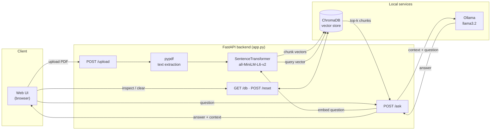
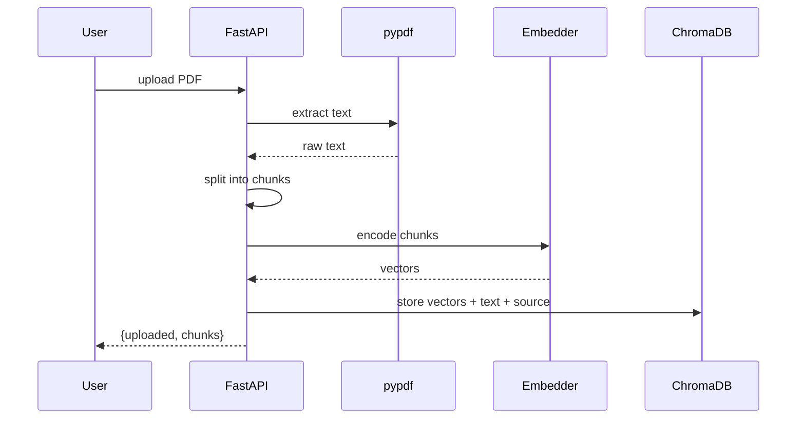
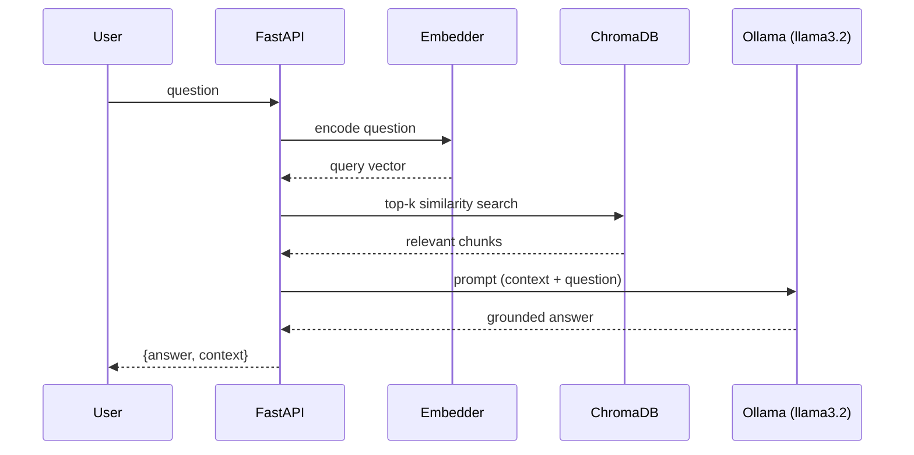

# Mini RAG

A minimal **Retrieval-Augmented Generation (RAG)** demo: upload a PDF, its content is
indexed into a vector database, and you can ask natural-language questions that are
answered **only** from the uploaded documents. The language model runs locally through
[Ollama](https://ollama.com), so no data leaves your machine and no paid API key is
required.

## Architecture



## How it works

The RAG flow has three phases:

1. **Ingestion** — the PDF text is extracted, split into chunks, and turned into vectors
   (embeddings) using the `all-MiniLM-L6-v2` model. The vectors are stored in ChromaDB.
2. **Retrieval** — the user question is converted into a vector and the `k` most
   semantically similar chunks are searched in the database (default `k=5`).
3. **Generation** — the retrieved chunks are passed as context to an LLM (`llama3.2` via
   Ollama), which generates an answer grounded in that context.

**Ingestion flow** (`POST /upload`):



**Query flow** (`POST /ask`):



## Requirements

- Python 3.11+
- [Ollama](https://ollama.com) installed and running, with the model pulled:
  ```bash
  ollama pull llama3.2
  ```

## Running locally

```bash
# 1. Virtual environment and dependencies
python3 -m venv .venv
source .venv/bin/activate
pip install -r requirements.txt

# 2. Start the server (Ollama must already be running)
uvicorn app:app --reload
```

The app is available at `http://localhost:8000`.

## Running with Docker

```bash
docker build -t mini-rag .
docker run -p 8000:8000 \
  -e OLLAMA_URL=http://host.docker.internal:11434/v1 \
  mini-rag
```

`host.docker.internal` lets the container reach Ollama running on the host machine.

## Web interface

Opening `http://localhost:8000` gives you a minimal UI to:

- **Upload PDF** — index a document into the vector store
- **Show DB** — view the stored chunks and their source
- **Clear DB** — empty the database
- **Send** — ask a question about the uploaded documents

## API

| Method | Endpoint  | Description |
|--------|-----------|-------------|
| `GET`  | `/`       | Web interface |
| `POST` | `/upload` | Upload and index a PDF (`multipart/form-data`, field `file`) |
| `POST` | `/ask`    | Ask about the documents — body `{"question": "..."}` |
| `GET`  | `/db`     | Vector store contents (chunks + metadata) |
| `POST` | `/reset`  | Empty the vector store |

Example:

```bash
curl -X POST http://localhost:8000/ask \
  -H "Content-Type: application/json" \
  -d '{"question": "What technical skills are listed?"}'
```

## Configuration

| Variable     | Default                          | Description |
|--------------|----------------------------------|-------------|
| `OLLAMA_URL` | `http://localhost:11434/v1`      | Ollama OpenAI-compatible endpoint |

The vector store persists in `./chroma_db/`: delete the folder (or use `/reset`) to start
from an empty database.

## Tech stack

- **FastAPI** — web framework and API
- **ChromaDB** — persistent vector database
- **sentence-transformers** (`all-MiniLM-L6-v2`) — embedding generation
- **Ollama** (`llama3.2`) — local language model
- **pypdf** — PDF text extraction
